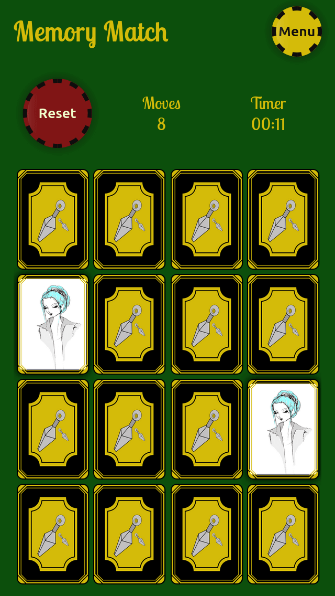
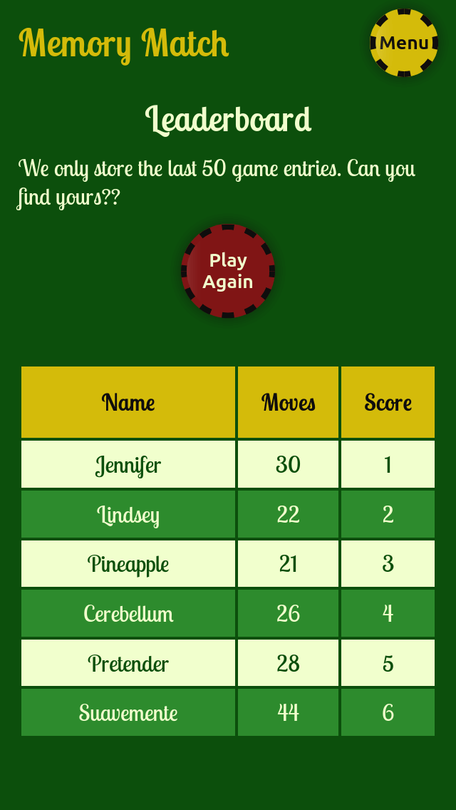
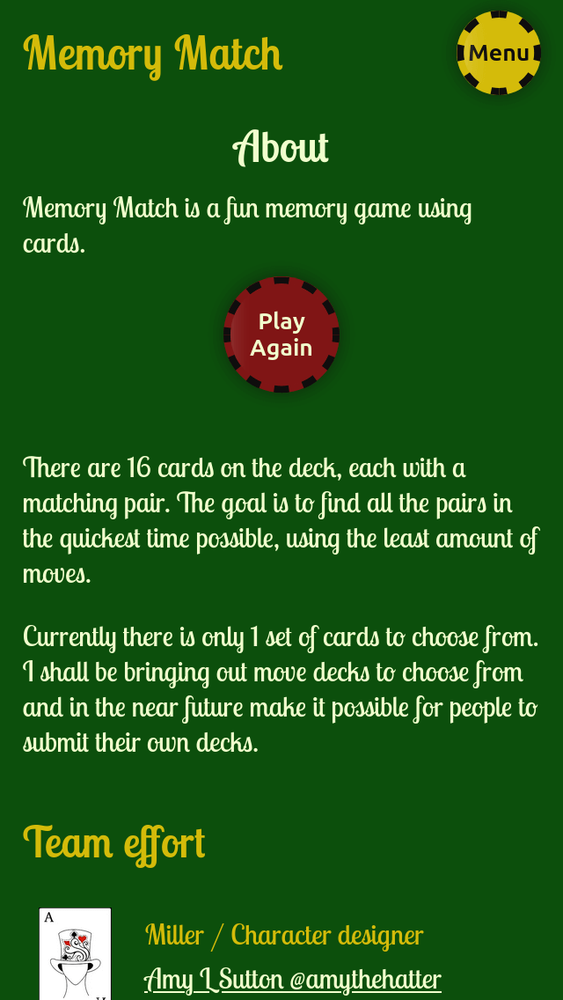
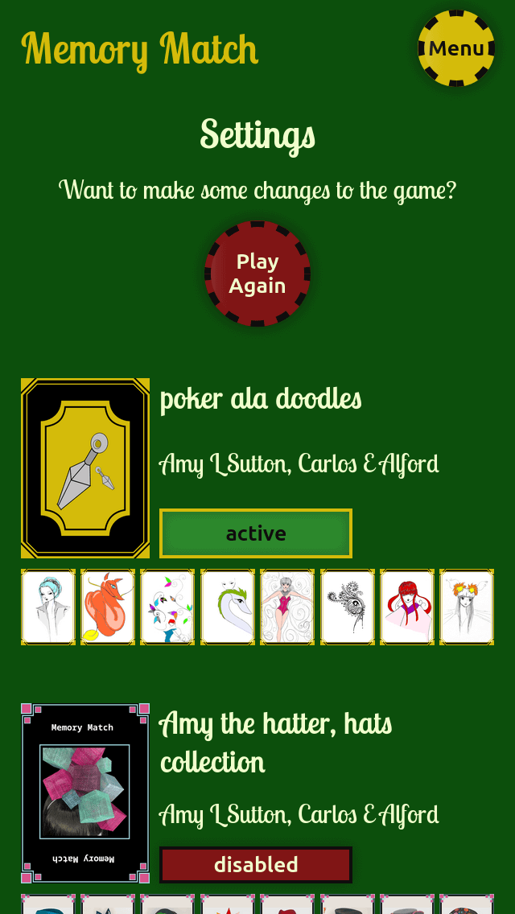
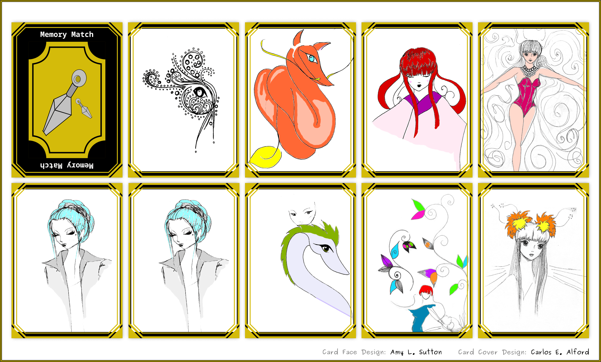
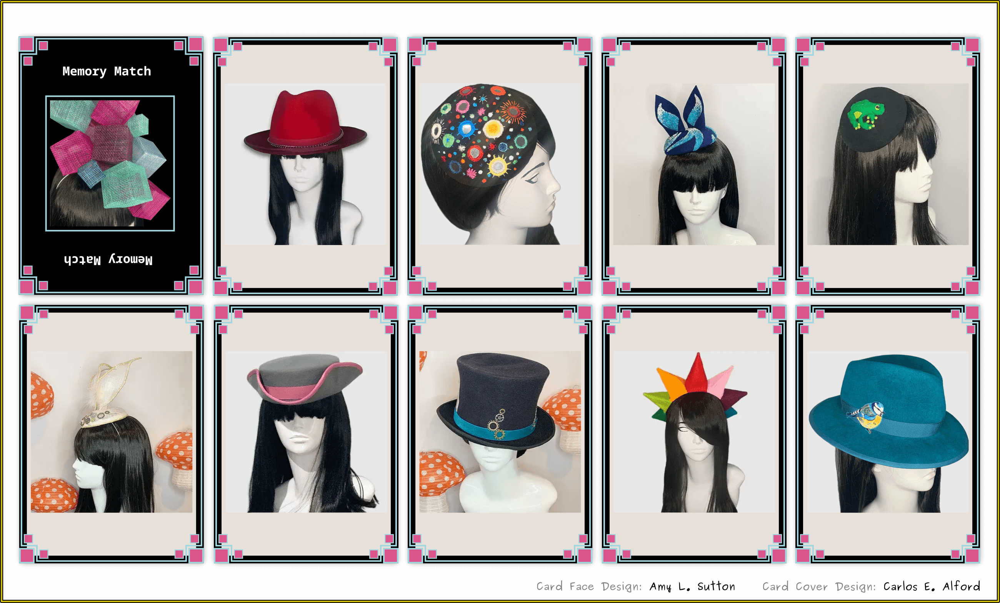

# Memory Match :video_game:

A fun memory game with cards, just find the pairs. :balloon: [Play the game](https://webshuriken.github.io/memory-match/)

## Installation

The game app is live but you can also play it locally.

1. `Clone the repo`
2. inside the repo folder `npm i` to install dependencies
3. `npm start` to run the game on localhost:3000

## Features

- Timer and moves tracker
- Cards flip on click
- Settings allow for selection of different deck of cards
- Leaderboard that shows the top 30 scores, currently locally only
- Unit and Integrations tests. All components are tested.

## Tech Stack

- React js
- Pure CSS (because it is sweet)
- Cloudinary
- Badwords and Badwords filter
- Inkscape

## Screenshots

**Home**

**Leaderboard**

**About**

**Settings**

**Deck of Cards**

## Color Theme

| Color             | Hex                                                                |
| ----------------- | ------------------------------------------------------------------ |
| Dark green |  #0b4f0b |
| Mustard |  #d3bc0a |
| Red |  #7f1414 |
| Dark |  #0f0d0d |
| Light Green |  #2c8c2c |
| Light |  #f0ffcc |

## Thoughts

The project was an excellent opportunity to practice my Typescript. To tell the truth, slow start and strong finish. I am loving the idea of typing in JS, specially the ability to create custom types. Dwelling on the past is no use when you want to evolve. I do want to point out, that adding types to a project definately needs planning and takes time!, still fun.

The images for the app are hosted in Cloudinary and so far their service has been fantastic. Getting started with the SDK was a struggle because it kept talking about transforming images and not so much on how to create simple requests for an image. The SDK for React is nice but a little much for this project. In the end I used a basic request for the images url so I can display them.

## Roadmap

**FEAT-Game-1** ✅
- Setting page to allow a user to:
  - choose a deck of cards

**FEAT-Game-2**
- Setting page to allow a user to:
  - choose the difficulty (how many cards to play with).

This will affect the existing decks as they only contain 8 cards each. Having a difficulty level means adding more cards per game or we could just increase the difficulty of the actual images on the cards.

**FEAT-Game-3**
- Store players data in a DB so we can use this data to make the game more competitive.

Having life data that is shared across anyone playing the game would be awesome and a way for people to be competing for best score. This feature, naturally follows the difficulty level.

## Acknowledgements

Here are some of the npm packages I used for the project:

- [badwords-filter](https://www.npmjs.com/package/badwords-filter) An easy-to-use word filter with advanced detection techniques.
- [badwords](https://www.npmjs.com/package/badwords) A highly consumable list of bad (profanity) English words based on the nice short and simple list found in Google's "what do you love" project made accessible by Jamie Wilkinson.

## License

[MIT](https://choosealicense.com/licenses/mit/)
